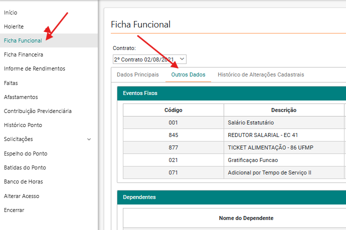
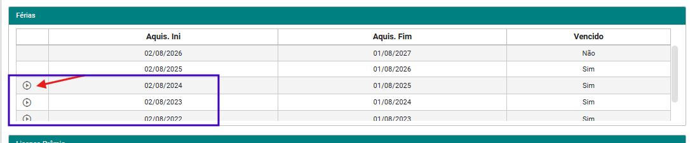
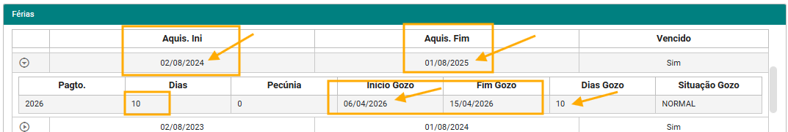
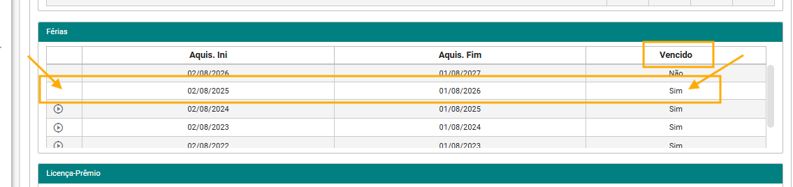

# Como Consultar seu Período de Férias no Holerite

> Guia simples e visual para qualquer servidor verificar, sozinho, os seus períodos de férias **vencidos e a vencer** — direto pelo holerite.

Você não precisa abrir chamado para isso. Em menos de 1 minuto você consegue ver:
* Quais períodos aquisitivos você já possui
* Quantos dias já foram gozados (parcial ou integral)
* Quando foi o gozo
* Se existe período **vencido** sem gozo

---

## 📋 O que você vai precisar

* Acesso ao sistema do holerite
* 1 minuto do seu tempo

---

## Passo 1 — Acesse a Ficha Funcional > Outros Dados

1. Entre no seu **Holerite**
2. Clique em **Ficha Funcional**
3. Na janela que abrir, clique na guia **Outros Dados**

> **Onde clicar:** Holerite → Ficha Funcional → guia `Outros Dados`

---

## Passo 2 — Desça até a Tabela de Férias

Role a barra de rolagem para baixo até encontrar a **Tabela de Férias**.

Ali você vê todos os seus períodos aquisitivos.

**Como entender a tabela:**

* **Se tem uma SETA (▶) na linha:** significa que esse período **já foi utilizado**, seja parcialmente ou integralmente. Você pode clicar na seta para ver mais detalhes.
* **Se NÃO tem seta:** esse período ainda **não teve nenhum dia de gozo**.

> **Dica:** É por essa seta que você consegue ver o histórico de quando suas férias foram gozadas.

---

## Passo 3 — Veja quando suas férias foram gozadas

Clique na **seta** do período que você quer consultar.

Vai abrir o detalhamento com a quantidade de dias gozados e a data.

**Exemplo da imagem:**

* Período aquisitivo: **2024 a 2025**
* Gozo: **10 dias**
* Data em que foi usufruído: **06/04/2026**

> Ou seja: se você clicar na seta, consegue ver exatamente **quantos dias** usou e **quando** usou.

---

## Passo 4 — Como saber se tenho período VENCIDO sem gozo?

Ainda na mesma tabela, observe a coluna **Vencido**.

* Se estiver escrito **SIM** na coluna `Vencido` e **NÃO houver seta** na linha → significa que o período está **vencido e ainda não teve nenhum dia de férias gozado**.

> **Resumo:** `Vencido = SIM` + `sem seta` = período vencido que ainda precisa ser gozado.

---

## ✅ Resumo rápido para não esquecer

| O que aparece na tabela | O que significa |
|---|---|
| **Tem seta (▶)** | Período já foi usado (parcial ou total). Clique para ver dias e data do gozo. |
| **Não tem seta** | Período ainda não teve gozo de férias. |
| **Vencido = SIM + sem seta** | Período vencido, sem nenhum dia gozado. Precisa programar as férias. |
| **Vencido = NÃO** | Período ainda dentro do prazo para gozo. |

---

## ❓ Dúvidas frequentes

**1. Meu período aparece como Vencido = SIM, isso é um problema?**
Significa apenas que o período aquisitivo já venceu e ainda não houve gozo. Procure sua chefia/RH para programar.

**2. Cliquei na seta e não abriu nada?**
É porque aquele período específico não teve gozo ainda, por isso não tem detalhamento.

**3. Posso ver férias fracionadas?**
Sim. Se você gozou 10 dias de um período e ainda restam 20, a seta mostrará o detalhamento dos 10 dias já utilizados.

---

## 📌 Importante

> Este guia mostra **apenas a consulta de FÉRIAS**. Para dúvidas sobre saldo, agendamento ou conversão, entre em contato com o RH da sua Secretaria.

---

### Quer compartilhar este guia?

Basta enviar o link deste repositório no GitHub. Qualquer servidor consegue seguir o passo a passo sozinho, sem precisar de ajuda.

*Última atualização: Setembro de 2026*
